# Firoj Siddiquie (ソヌ)

**Platform & Security Engineer**

*Architect it right. Ship it fast. Keep it minimal.*

[sonusid.in](https://sonusid.in) · [LinkedIn](https://linkedin.com/in/firojsiddiquie) · [X (@spideydotjs)](https://x.com/spideydotjs) · [Email](mailto:sonusid1325@gmail.com)

 

---

## 🛠️ Stack

- **Languages:** Go · Rust · Kotlin · TypeScript · Java · Python
- **Infra & Cloud:** Kubernetes · Docker · Kafka · gRPC · eBPF · Redis · PostgreSQL · Supabase
- **Frontend & Mobile:** React · Next.js · Tailwind · Jetpack Compose

---

## 🚀 Projects

### 🛡️ Security & Systems

| Project | Description | Tech Stack |
| :--- | :--- | :--- |
| **[legit](https://github.com/spideydotjs/legit)** | Privacy-preserving KYC & document verification protocol utilizing Ed25519 cryptography. Presented at *Graphathon 2025* @ Graphic Era University. | `Kotlin` `Ed25519` `Zero-Knowledge` |
| **[codewarts-frontend](https://github.com/spideydotjs/codewarts-frontend)** + **[backend](https://github.com/spideydotjs/codewarts-backend)** | Story-based interactive Linux learning platform designed as an arcade game. | `Go` `Docker` `Next.js` `TypeScript` |
| **[woodpecker-rs](https://github.com/spideydotjs/woodpecker-rs)** | High-performance, RFC-compliant SMTP mail server built from scratch in Rust. | `Rust` `SMTP` `Networking` |
| **[sherlock](https://github.com/spideydotjs/sherlock)** ⭐ 1 | OSINT tool to search for profiles across social networks. | `JavaScript` `CLI` `OSINT` |

### ⚙️ Infrastructure & DevOps

| Project | Description | Tech Stack |
| :--- | :--- | :--- |
| **[kube-deploy](https://github.com/spideydotjs/kube-deploy)** ⭐ 6 | Zero-downtime deployment pipeline for Kubernetes clusters with automated rollback and health monitoring. | `Go` `Kubernetes` `gRPC` `Docker` |
| **[baklava-arch](https://github.com/spideydotjs/baklava-arch)** | Custom Arch-based Linux distribution pre-baked with modern end4 Hyprland dotfiles. | `Arch Linux` `archiso` `Hyprland` `Shell` |
| **[pawrcel](https://github.com/spideydotjs/pawrcel)** | Cross-platform file transfer agent designed to transfer files over long distances using P2P handshakes. | `Kotlin` `P2P` `Networking` |

### 🔗 Blockchain & Web3

| Project | Description | Tech Stack |
| :--- | :--- | :--- |
| **[certify-sol](https://github.com/spideydotjs/certify-sol)** + **[certify-ui](https://github.com/spideydotjs/certify-ui)** | Blockchain-based certificate issuance and verification management system built on Solana. | `Solana` `Rust` `TypeScript` `React` |
| **[kCoin](https://github.com/spideydotjs/kCoin)** | A basic blockchain implementation to demonstrate decentralized ledger architectures and hashing. | `Kotlin` `Blockchain` `Cryptography` |

### 📱 Android & Mobile

| Project | Description | Tech Stack |
| :--- | :--- | :--- |
| **[ollama-android](https://github.com/spideydotjs/ollama-android)** ⭐ 26 | Full-featured, native Ollama client for running and interacting with LLMs locally on Android. | `Kotlin` `Jetpack Compose` `AI` |
| **[Soundcore](https://github.com/spideydotjs/Soundcore)** | Expressive Material 3 music player supporting local media files and YouTube Music integration. | `Kotlin` `Jetpack Compose` `Android` |
| **[Sekura](https://github.com/spideydotjs/Sekura)** | Material 3 based, open-source 2FA (Two-Factor Authentication) security application. | `Kotlin` `Security` `Android` |
| **[UniVerse](https://github.com/spideydotjs/UniVerse)** | Student community workspace platform built to connect peers. | `Kotlin` `Android` `Community` |
| **[TicTacToe](https://github.com/spideydotjs/TicTacToe)** | Clean Tic-Tac-Toe game experience showcasing Compose state management. | `Kotlin` `Jetpack Compose` |
| **[LocalVPNtunnel](https://github.com/spideydotjs/LocalVPNtunnel)** | Local VPN tunneling utility built for secure networking. | `Kotlin` `VPN` `Networking` |

### 🛠️ Developer Tools & Utilities

| Project | Description | Tech Stack |
| :--- | :--- | :--- |
| **[vectopus](https://github.com/spideydotjs/vectopus)** | Browser-based PNG-to-SVG vectorization studio with real-time canvas preprocessing and trace customization. | `TypeScript` `React` `SVG` |
| **[apidash](https://github.com/spideydotjs/apidash)** | Cross-platform, AI-powered API client built using Flutter (Postman alternative). | `Dart` `Flutter` `API` |
| **[gemini_cli](https://github.com/spideydotjs/gemini_cli)** | Command-line utility to chat with the Gemini API. | `Go` `CLI` `Gemini` |
| **[Gemini-API](https://github.com/spideydotjs/Gemini-API)** | Gemini API request handling and integration patterns in Kotlin. | `Kotlin` `API` `Gemini` |
| **[deno-discord-bot](https://github.com/spideydotjs/deno-discord-bot)** | A Discord bot powered by Deno.js and the Gemini API. | `TypeScript` `Deno` `Discord` |
| **[hyprdroid](https://github.com/spideydotjs/hyprdroid)** ⭐ 3 | Android-themed Hyprland configuration dotfiles and Quickshell scripts. | `QML` `Hyprland` `Wayland` |
| **[woodpecker.py](https://github.com/spideydotjs/woodpecker.py)** | Lightweight python automation script designed for cold email outreach. | `Python` `Automation` `Email` |

> **[→ View all repositories](https://github.com/spideydotjs?tab=repositories)**

---

 

*“commits aren't contributions. working code is.”*

